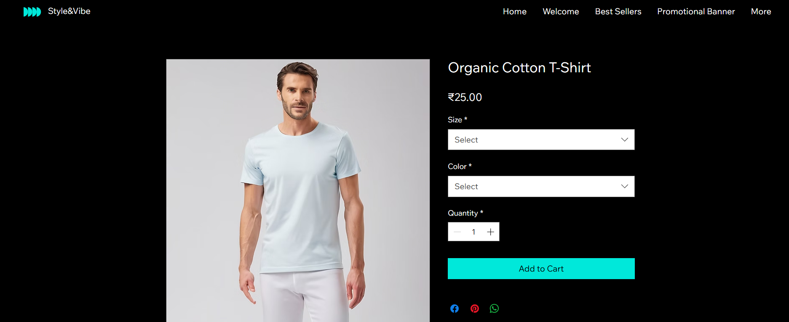
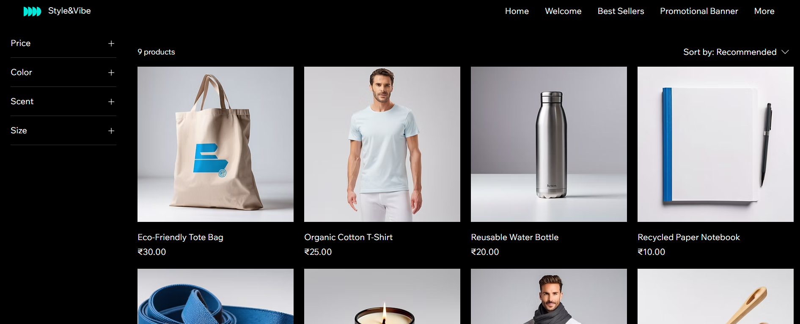
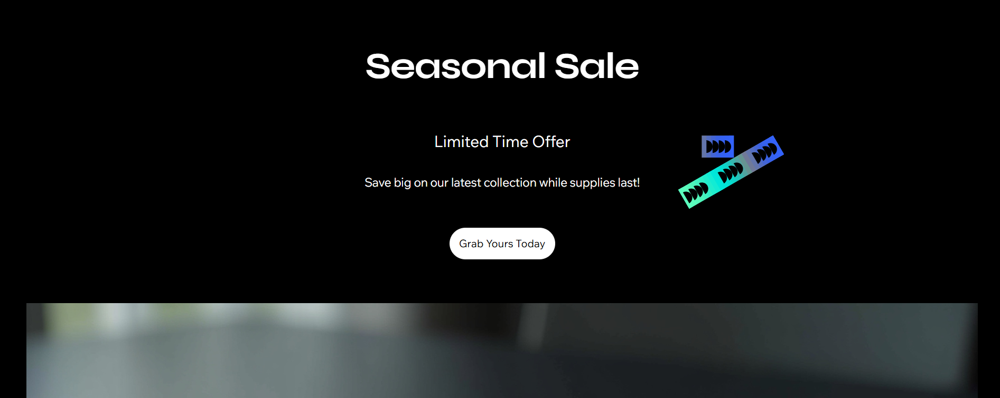

# 🛒 Stylish eCommerce Website

A modern, fully responsive eCommerce website featuring product collections, a clean shopping experience, and a user-friendly interface. Designed as a portfolio project to demonstrate real-world eCommerce design with interactive layout and mobile-first responsiveness.

---

## 🌐 Live Website

🔗 [View Live Project](https://chowdhury10soham.wixsite.com/style)

---

## 📌 Project Overview

**Project Name:** Stylish Online Store  
**Developer:** Soham Chowdhury  
**Type:** eCommerce Portfolio Project  
**Duration:** 2 weeks  
**Deployment:** Public  
**Device Compatibility:** ✅ Fully responsive on **desktop, tablet, and mobile**

---

## 🛠️ Tech Stack Used

- **Frontend:** HTML5, CSS3, JavaScript  
- **Frameworks:** React.js (concept-based), Tailwind CSS  
- **Design Principles:** Mobile-first design, responsive grid layout  
- **Hosting:** Vercel / Cloud Hosting

---

## ✨ Key Features

- 🛍️ Product listings with images and descriptions  
- 📦 Categorized collections for easy browsing  
- 🧾 Add to Cart concept & purchase flow  
- 📱 Mobile and desktop compatibility  
- 🖌️ Clean and minimal UI/UX  
- 📩 Contact form section with custom styling

---

## 📸 Screenshots

<h1>ORDERING PAGE</h1>

<H1>PRODUCTS PAGE</H1>

<H1>SALES PAGE</H1>

